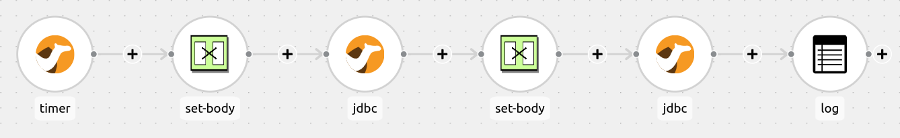

:walkthrough: Lab Introduction
:user-password: openshift
:namespace: {user-username}

:experimental:
:source-highlighter: pygments

:article-url: https://developers.redhat.com/articles/2023/08/15/some-article-url

ifdef::env-github[]
endif::[]

[id='lab-intro']
= Camel Quarkus - JDBC DataSource Lab

An example that shows how to connect to a Database using a data source.

This hands-on lab is based on the following blog article in Red Hat Developers:

* link:{article-url}[window="_blank", , id="rhd-source-article"]

{empty} +

Assuming you have followed the article's instructions, you should be all set to get hands-on with the _Camel Quarkus_ in the _OpenShift Dev Spaces_ workspace.

For illustration purposes, the picture below shows what the integration end-to-end flow looks like.

Data is periodically inserted into a data store and then queried to display a running count of the records.

{empty} +

[time=2]
[id="section-one"]
== Explore the source code

All the source code for this example can be found in the project explorer under the `jdbc-datasource` directory.

=== Routes

Start by opening the route definition in the following file:

--
`src/main/java/org/acme/jdbc/JdbcRoutes.java`
--

The first half of the route inserts records into the databsae:

----
from("timer://insertCamel?period=1000")
        .log("Inserting Camel ${messageTimestamp}")
        .setBody().simple("INSERT INTO camel (timestamp) VALUES (${messageTimestamp})")
        .to("jdbc:camel-ds")
----

- The `timer` component sends a message every 1000 milliseconds.
- The unix timestamp of the message, identified with `${messageTimestamp}` in the Simple language, is logged to the console.
- The message body is populated with an `INSERT` statement. The `messageTimestamp` value will be inserted into the `timestamp` column in the `camel` table.
- The `jdbc` component executes the statement in the message body on the data source referenced by the `camel-ds` identifier.

The second half retrieves all the records and logs the count and individual entries:

----
        .setBody().simple("SELECT * FROM camel")
        .to("jdbc:camel-ds")
        .log("We have ${header[CamelJdbcRowCount]} camels in the database.")
        .log("Camels found: ${body}");
----

The second half of the route is very similar to the first half, although this time a SQL `SELECT` query is passed to the `jdbc` component. 

=== Database Set-up

The `camel` table used by the above SQL statements is created in the following class:

--
`src/main/java/org/acme/jdbc/JdbcResource.java`
--

The `JdbcResource` class implements the `startup` observer method, which will be invoked by Quarkus during the example's startup phase. A connection is established to the `camel-ds` Agroal DataSource that was injected into the class. The method then executes two SQL statements, first dropping the `camel` table if it already exists to avoid reusing data from previous runs; and then creating the table.

=== Application Properties

The database connection properties are specified in the `src/main/resources/application.properties` file.

When running locally, the H2 database is used, and Quarkus will use Dev Services to automatically start up a database instance. However, when running in OpenShift Dev Spaces, Dev Services doesn't work due to limitations with starting containers within a container. Instead, the `k8s` profile is used to define the connection parameters to a MySql database. These properties are defined below:

----
%k8s.quarkus.datasource.camel-ds.db-kind=mysql
%k8s.quarkus.datasource.camel-ds.username=cquser
%k8s.quarkus.datasource.camel-ds.password=cqpass
%k8s.quarkus.datasource.camel-ds.jdbc.url=jdbc:mysql://localhost:3306/testdb
----

{empty} +

[time=2]
[id="section-two"]
== Run the example

The example can either be launched in OpenShift Dev Spaces by running a VS Code task, or entering commands directly in a terminal.

To start the example from a task, open the menu and selecting `Terminal > Run Task...` and then select `devfile: start-jdbc-datasource`.

Alternatively, you can open a terminal from the menu by selecting `Terminal > New Terminal (Select a container)` and selecting the `tools` container. Then copy and paste the following commands:

[source, subs=]
----
cd /projects/examples/jdbc-datasource && mvn -Dquarkus.profile=k8s clean quarkus:dev
----

After a few seconds, you should start seeing output similar to the following:

----
2023-10-13 10:54:26,199 INFO  [route1] (Camel (camel-1) thread #1 - timer://insertCamel) Inserting Camel 1697194460199
2023-10-13 10:54:26,202 INFO  [route1] (Camel (camel-1) thread #1 - timer://insertCamel) Inserted Camel 1697194460199
2023-10-13 10:54:26,205 INFO  [route1] (Camel (camel-1) thread #1 - timer://insertCamel) We have 3 camels in the database.
2023-10-13 10:54:26,206 INFO  [route1] (Camel (camel-1) thread #1 - timer://insertCamel) Camels found: [{id=1, timestamp=1697194458198}, {id=2, timestamp=1697194459199}, {id=3, timestamp=1697194460199}]
----

{empty} +

[type=verification]
Did you obtain similar log messages to the output shown above?

[type=verificationSuccess]
You've successfully run the example !!

[type=verificationFail]
Inspect the logs to investigate possible causes of failure.

{empty} +

[time=5]
[id="section-three"]
== Split Results Into Separate Messages

You'll see from the output in the previous section that all results are logged in a single message. This is because the object returned from the query is an `ArrayList<HashMap<String,Object>>`. The Splitter EIP can be used to separate the result set into separate messages.

Open the `src/main/java/org/acme/jdbc/JdbcRoutes.java` file in the editor and insert the `split` line just above the last log statements in the route:

----
        .setBody().simple("SELECT * FROM camel")
        .to("jdbc:camel-ds")
        .split(body())
        .log("We have ${header[CamelJdbcRowCount]} camels in the database.")
        .log("Camels found: ${body}");
----

If the example application is still running in `dev` mode, then saving the changes will cause the application to be rebuilt and restarted automatically. If not, restart the application either by running the `devfile: start-jdbc-datasource` task, or running `mvn clean quarkus:dev` in the `tools` terminal.

After making the above change, you should now see each `SELECT` query will generate multiple log messages:

----
2023-11-09 13:49:47,865 INFO  [route1] (Camel (camel-1) thread #1 - timer://insertCamel) Inserted Camel 1699537787860
2023-11-09 13:49:47,870 INFO  [route1] (Camel (camel-1) thread #1 - timer://insertCamel) We have 2 camels in the database.
2023-11-09 13:49:47,871 INFO  [route1] (Camel (camel-1) thread #1 - timer://insertCamel) Camels found: {ID=1, TIMESTAMP=1699537786859}
2023-11-09 13:49:47,872 INFO  [route1] (Camel (camel-1) thread #1 - timer://insertCamel) We have 2 camels in the database.
2023-11-09 13:49:47,872 INFO  [route1] (Camel (camel-1) thread #1 - timer://insertCamel) Camels found: {ID=2, TIMESTAMP=1699537787860}
----

In the above output, you can see that the total result count is now displayed before each timestamped Camel item.

When dealing with queries that return a large number of rows, this approach becomes memory-intensive as the entire result set is read into memory. By switching to a streaming approach, each row is returned on demand. You can enable streaming by making the following changes to the route:

----
        .setBody().simple("SELECT * FROM camel")
        .to("jdbc:camel-ds?outputType=StreamList")
        .split(body()).streaming()
        .log("We have ${header[CamelJdbcRowCount]} camels in the database.")
        .log("Camels found: ${body}");
----

Note that you need to set the `outputType` on the JDBC component to `StreamList` as well as enabling streaming on the `split` component.

When running the example with these modifications, you'll now see output similar to the following:

----
2023-11-09 14:03:35,851 INFO  [route1] (Camel (camel-1) thread #1 - timer://insertCamel) Inserted Camel 1699538615845
2023-11-09 14:03:35,854 INFO  [route1] (Camel (camel-1) thread #1 - timer://insertCamel) We have  camels in the database.
2023-11-09 14:03:35,855 INFO  [route1] (Camel (camel-1) thread #1 - timer://insertCamel) Camels found: {ID=1, TIMESTAMP=1699538614845}
2023-11-09 14:03:35,856 INFO  [route1] (Camel (camel-1) thread #1 - timer://insertCamel) We have  camels in the database.
2023-11-09 14:03:35,857 INFO  [route1] (Camel (camel-1) thread #1 - timer://insertCamel) Camels found: {ID=2, TIMESTAMP=1699538615845}
----

One thing to notice from the above output is that the row count is now missing from the log messages. When streaming is enabled, Camel doesn't populate the `CamelJdbcRowCount` header as it can't determine the total number of rows in the result set because they haven't all been loaded into memory.

{empty} +

[time=9]
[id="section-four"]
== Using Parameterised Queries

Using parameterised queries allows placeholder names to be specified in the SQL query that are substituted from values stored in the message header. This approach can help to prevent SQL injection attacks.

To demonstrate this principle, the route will be modified to expose the `INSERT` statement from a REST endpoint, allowing a user to post a custom message to the `camel` table. The example stores the timestamps as a `VARCHAR`, so the `timestamp` column can be repurposed to store short arbitrary messages.

Open the `src/main/java/org/acme/jdbc/JdbcRoutes.java` file in the editor and first split the single route into two separate routes - one to handle inserts and another to handle queries. The insert route will be initiated by the `direct` component so it can be called from a rest endpoint. The query route will be called directly from the timer:

----
// Insert route
from("direct:insert-message")
        .log("Inserting Camel ${headers.message}")
        .setBody().simple("INSERT INTO camel (timestamp) VALUES ('${headers.message}')")
        .to("jdbc:camel-ds")
        .log("Inserted Camel ${headers.message}");

// Query route
from("timer://insertCamel?period=1000")
        .setBody().simple("SELECT * FROM camel")
        .to("jdbc:camel-ds")
        .log("We have ${header[CamelJdbcRowCount]} camels in the database.")
        .log("Camels found: ${body}");
----

The value being inserted into the `camel` table is coming from the `message` header, which hasn't yet been set. Add a REST endpoint above the insert route as follows:

----
rest()
        .post("/camel/{message}")
        .param().name("message").type(RestParamType.path).dataType("string").endParam()
        .to("direct:insert-message");
----

This creates a REST endpoint that listens for POST requests on http://localhost:8080/camel/{message}. `{message}` is a path parameter, and its value will be stored in the `message` property in the message header. Finally, the `direct:insert-message` route is called, which handles the database insertion.

The `RestParamType` class will also need to be imported:

----
import org.apache.camel.model.rest.RestParamType;
----

Before you can build the modified example, you'll need to add a couple of dependencies to the `pom.xml` file in order to use the `rest` and `direct` components:

----
<dependency>
    <groupId>org.apache.camel.quarkus</groupId>
    <artifactId>camel-quarkus-direct</artifactId>
</dependency>
<dependency>
    <groupId>org.apache.camel.quarkus</groupId>
    <artifactId>camel-quarkus-rest</artifactId>
</dependency>
----

If the example application is still running in `dev` mode, then saving the changes will cause the application to be rebuilt and restarted automatically. If not, restart the application either by running the `devfile: start-jdbc-datasource` task, or running `mvn clean quarkus:dev` in the `tools` terminal.

As the example is no longer inserting timestamps periodically, the terminal will just display logs containing 0 records every second. To insert a `hello` message, run the following command in the `tools` terminal:

[source,bash]
----
curl -X POST http://localhost:8080/camel/hello
----

You can confirm that the `curl` command worked correctly by checking the console log. You should now see 1 message returned in the logs:

----
2023-11-10 11:17:59,456 INFO  [route2] (Camel (camel-1) thread #1 - timer://insertCamel) We have 1 camels in the database.
2023-11-10 11:17:59,457 INFO  [route2] (Camel (camel-1) thread #1 - timer://insertCamel) Camels found: [{ID=1, TIMESTAMP=hello}]
----

=== SQL Injection

SQL injection occurs when an attacker can manipulate the input to a SQL query in a way that the query's structure is altered, leading to unintended and potentially malicious actions. The example we'll use will inject a delete statement, but by default the MySQL JDBC driver doesn't allow multiple statements to be executed from a single invocation. To circumvent this restriction for the purposes of this tutorial, alter the JDBC url in the `src/main/resources/application.properties` file as follows:

----
%k8s.quarkus.datasource.camel-ds.jdbc.url=jdbc:mysql://localhost:3306/testdb?allowMultiQueries=true
----

Before trying the SQL injection attack, run the previous `curl` command to ensure there is a valid message in the database:

----
curl -X POST http://localhost:8080/camel/hello
----

Next, to demonstrate an attack, try sending the message `hello'); delete from camel; -- ` to the camel endpoint. It needs to be URL encoded to avoid misinterpretation by the shell:

[source,bash]
----
curl -X POST "http://localhost:8080/camel/hello%27%29%3B%20delete%20from%20camel%3B%20--%20"
----

The `');` in the message terminates the `INSERT` statement constructed in the route, and then injects a `DELETE` statement to remove all rows from the `camel` table. The final `--` comments out everything after the `${headers.message}` in the route's `INSERT` statement. To verify the delete statement was executed, check the example log and verify that zero camels have been found.

One way to prevent this kind of attack is to use parameterised statements. Instead of inserting values directly into the statement, named placeholders can be used instead. Parameters are specified using `:?` notation before the parameter name, e.g. `:?message`. By enabling the `useHeadersAsParameters` option on the JDBC component, values in the headers will be substituted for their corresponding named parameters in the SQL statement. The values will be sanitised during the substitution to ensure any special characters have been escaped.

Change the `INSERT` statement and `jdbc` endpoint as follows:

----
from("direct:insert-message")
        .log("Inserting Camel ${headers.message}")
        .setBody().simple("INSERT INTO camel (timestamp) VALUES (:?message)")
        .to("jdbc:camel-ds?useHeadersAsParameters=true")
        .log("Inserted Camel ${headers.message}");
----

If you re-run the above two `curl` commands, you should see that both the `hello` message and the failed attempt at SQL injection are displayed as messages:

----
2023-11-10 15:37:17,647 INFO  [route2] (Camel (camel-1) thread #1 - timer://insertCamel) We have 2 camels in the database.
2023-11-10 15:37:17,648 INFO  [route2] (Camel (camel-1) thread #1 - timer://insertCamel) Camels found: [{ID=1, TIMESTAMP=hello}, {ID=2, TIMESTAMP=hello'); delete from camel; --}]
----
