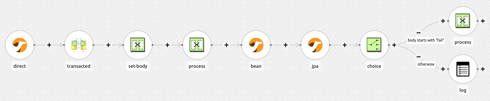

:walkthrough: Lab Introduction
:user-password: openshift
:namespace: {user-username}

:experimental:

:article-url: https://developers.redhat.com/articles/2023/08/15/some-article-url

ifdef::env-github[]
endif::[]

[id='lab-intro']
= Camel Quarkus - JTA-JPA Lab

An example Camel Quarkus application that supports JTA transactions.

This hands-on lab is based on the following blog article in Red Hat Developers:

* link:{article-url}[window="_blank", , id="rhd-source-article"]

{empty} +

Assuming you have followed the article's instructions, you should be all set to get hands-on with _Camel Quarkus_ in the _OpenShift Dev Spaces_ workspace.

Two REST endpoints are defined as gateways to the Camel routes: the POST method creates audit records inside a transaction, and the GET method retrieves them and logs them to the console.

{empty} +

[time=7]
[id="section-one"]
== Explore the source code

All the source code for this example can be found in the project explorer under the `jta-jpa` directory.

=== Routes

The route definition can be found in the following file:

--
`src/main/java/org/acme/CamelRoutes.java`
--

The first statement in the `configure()` method sets up the REST API:

----
rest("/messages")
        .produces("text/plain")
        .get()
        .to("direct:messages")
        .post("/{message}")
        .param().name("message").type(RestParamType.path).dataType("string").endParam()
        .to("direct:trans");
----

Camel's REST DSL is used to create routes from HTTP endpoints to other components. The `rest("/messages")` call defines a set of REST services that return data as plain text. The GET verb returns data from the `direct:messages` endpoint. The POST verb defines the `messages/{message}` endpoint that is connected to the `direct:trans` endpoint. The braces surrounding `{message}` indicate this is a parameter, with the parameter defined on line 6 above.

The Direct component provides a simple way to send synchronous messages within a `CamelContext`. The `messages` endpoint below is called from the `get()` endpoint:

----
from("direct:messages")
        .to("jpa:org.acme.AuditLog?namedQuery=getAuditLog")
        .convertBodyTo(String.class);
----

The `messages` direct endpoint sends a message to the JPA producer requesting the execution of the `getAuditLog` named query on the `AuditLog` class. The `AuditLog` class will be examined in the next section. The result of the query is stored in the message body as a `List<AuditLog>`, which is then converted to a String so that it can be returned to REST client.

The `trans` direct endpoint handles the more complex case of storing a message inside a transaction, which is invoked when the POST endpoint is called on the REST API. The picture below illustrates the main stages of the route:

To aid explanation, the route will be described in three sections. The first section sets up the transaction:

----
from("direct:trans")
        .transacted()
        .setBody(simple("${headers.message}"))
        .process(x -> {
            DummyXAResource xaResource = new DummyXAResource("crash".equals(x.getIn().getBody   (String.class)));
            transactionManager.getTransaction().enlistResource(xaResource);
        })
----

The `transacted()` method begins a transaction whose scope runs to the end of the route. The transaction will be committed if control sucessfully reaches the end of the route, or rolled back if an exception is thrown by any of the components.

The database connection and the `DummyXAResource` are both managed by the transaction, so a global transaction manager is needed. The example uses the Narayana Transaction Manager that comes with Quarkus by adding the `io.quarkus:quarkus-narayana-jta` dependency to the POM.

The third line prepares the message to be stored in the database by extracting the `message` parameter from the header and storing it in the body.

Lines 4-8 define a custom process that creates a dummy XA resource and registers it in the TransactionManager made available to the class via the `@Inject` annotation. The `DummyXAResource` will be examined in more detail in a later section.

The second part of the route persists the message in the database:

----
        .to("bean:auditLog?method=createAuditLog(${body})")
        .to("jpa:org.acme.AuditLog")
----

The first line passes the body of the message, which contains the paramter passed to the POST method, to the `createAuditLog()` method of the `org.acme.AuditLog` bean instance. This method creates a new `AuditLog` instance with the message field initialised with the parameter value, which replaces the message body.

The message is next passed to the JPA producer endpoint, with `org.acme.AuditLog` specified as the entity type. The component extracts the object from the message body and inserts it into the MySQL database.

The final section of the route adds some logic to optionally test the roll-back of the transaction:

----
        setBody(simple("${headers.message}"))
        .choice()
        .when(body().startsWith("fail"))
        .log("Forced exception")
        .process(x -> {
            throw new RuntimeException("fail");
        })
        .otherwise()
        .log("Message added: ${body}")
        .endChoice();
----

The first line of this final part of the route resets the message body to the value of the initial parameter to the PUT endpoint. The `choice()` method then introduces a Content-Based Router into the route, which uses the content of the message body to determine the route's destination. In this case, if the parameter from the PUT call starts with `fail`, a custom processor throws a `RuntimeException`, which will trigger a roll-back of both the database and the `DummyXAResource`. If the message body contains anything else, the `otherwise()` branch is executed instead, which just logs the body to the console and allows the transaction to be committed.

=== AuditLog: JPA Entity

The `AuditLog` class is the JPA entity that Hibernate uses to map Java data to the relational database. You can view the class by opening the following file:

--
`src/main/java/org/acme/AuditLog.java`
--

As this is not a JPA tutorial, the description of this class will be limited to the Camel and Quarkus aspects. 

After the `@Entity` and `@Table` JPA annotations, the `@NamedQuery` used in the `messages` direct endpoint is defined. The `getAuditLog` query simply returns a list of all AuditLogs that have been sent to the POST endpoint and successfully processed.

The `@ApplicationScoped` annotation instructs Quarkus to instantiate an instance of the AuditLog bean during start-up, and the `@Named` annotation registers the bean in the CamelContext under the `auditLog` name. This matches the name used by the Bean component in the `trans` route to locate the instance.

The final annotation, `@RegisterForReflection`, is required when building a native executable to ensure that the class is included, as GraalVM will eliminate any code that isn't part of the call tree.

=== Dummy XA Resource

The `DummyXAResource` class is used in the example scenario to crash the application in order to demonstrate transaction recovery. You can view the source by opening the following file:

--
`src/main/java/org/acme/DummyXAResource.java`
--

The `DummyXAResource` is constructed by the `trans` direct route in the custom processor. If the message passed in to the PUT endpoint is equal to `crash`, then the resource will halt the application during the commit phase of the transaction, otherwise the resource essentially does nothing.

During a two-phase commit process, the Transaction Manager will first call the `prepare()` method, passing in the transaction ID. The `Xid` is written to a file in case it is needed later to recover the transaction.

Once all resources have been prepared, their `commit()` methods are called. This is where the Dummy resource halts the application if it is in crash mode. However, under normal operation, the transaction ID file is removed so that only crashed transactions are recovered.

=== Dummy XA Resource Recovery

The `DummyXAResourceRecovery` is an implementation of the JBoss XAResourceRecovery interface, and is responsible for recreating the crashed `DummyXAResource`. You can view the source by opening the following file:

--
`src/main/java/org/acme/DummyXAResourceRecovery.java`
--

The class is annotated with Quarkus' `@Startup` annotation, which instantiates the class when the platform is started. The `init()` method, annotated with the `@PostConstruct` annotation, is called once the `XAResourceRecoveryRegistry` dependency has been injected. The init method then registers that object as a resource recovery agent.

At some point shortly after the application has started, the `getXAResources()` method wil be called to reinstate the crashed resource. The directory containing the Xid files is searched for files, and new DummyXAResources created for each one (although there should only every be a single file). The Dummy XAResources are then returned from the `getXAResources()` method.

{empty} +

[time=5]
[id="section-two"]
== Run the example

The example can either be launched in OpenShift Dev Spaces by running a VS Code task, or entering commands directly in a terminal.

To start the example from a task, open the menu and selecting `Terminal > Run Task...` and then select `devfile: start-jta-jpa`.

Alternatively, you can open a terminal from the menu by selecting `Terminal > New Terminal (Select a container)` and selecting the `tools` container. Then copy and paste the following commands:

[source, subs=]
----
cd /projects/examples/jta-jpa && mvn -Dquarkus.profile=k8s clean quarkus:dev
----

Once the example is built and running, you should see output similar to the following:

----
2023-10-20 14:53:11,860 INFO  [org.apa.cam.imp.eng.AbstractCamelContext] (Quarkus Main Thread) Apache Camel 4.0.0 (camel-1) is starting
2023-10-20 14:53:11,897 INFO  [org.apa.cam.imp.eng.AbstractCamelContext] (Quarkus Main Thread) Routes startup (started:4)
2023-10-20 14:53:11,898 INFO  [org.apa.cam.imp.eng.AbstractCamelContext] (Quarkus Main Thread)     Started route1 (direct://messages)
2023-10-20 14:53:11,898 INFO  [org.apa.cam.imp.eng.AbstractCamelContext] (Quarkus Main Thread)     Started route2 (direct://trans)
2023-10-20 14:53:11,899 INFO  [org.apa.cam.imp.eng.AbstractCamelContext] (Quarkus Main Thread)     Started route3 (rest://get:/messages)
2023-10-20 14:53:11,900 INFO  [org.apa.cam.imp.eng.AbstractCamelContext] (Quarkus Main Thread)     Started route4 (rest://post:/messages:/%7Bmessage%7D)
2023-10-20 14:53:11,900 INFO  [org.apa.cam.imp.eng.AbstractCamelContext] (Quarkus Main Thread) Apache Camel 4.0.0 (camel-1) started in 39ms (build:0ms init:0ms start:39ms)
2023-10-20 14:53:11,905 INFO  [org.acm.DummyXAResourceRecovery] (Quarkus Main Thread) register DummyXAResourceRecovery
----

You can post a message to the example application by either running the `devfile: send-hello` task, or running the following command in the `tools` console:

[source,bash]
----
curl -X POST http://localhost:8080/api/messages/hello
----

You should see the `hello` message on the console.

To verify that the message was stored in the database, you can run the `devfile:get-messages` task, or run the following command from the `tools` console:

[source,bash]
----
curl http://localhost:8080/api/messages/
----

You should see the `hello` message listed in the console.

You can test for transaction roll-back by sending the `fail` message. Again, either run the `devfile:send-fail` task, or run the following command:

[source,bash]
----
curl -X POST http://localhost:8080/api/messages/fail
----

In this case, the route logic caused an exception to be thrown, so the database transaction was rolled back. If you run the `devfile:get-messages` task again, you should just see the original `hello` message on the console. The `fail` message will not be listed.

Finally, you can test the crash recovery process by first sending the `crash` message by either running the `devfile:send-crash` or running the following command:

[source,bash]
----
curl -X POST http://localhost:8080/api/messages/crash
----

This will cause the example to terminate and the curl command will exit with an error saying it received an empty message from the server. Restart the application by re-running the `devfile:start-jta-jpa` task, or running the following command in the `tools` console:

[source,bash]
----
mvn -Dquarkus.profile=k8s quarkus:dev
----

Note: Do not run `mvn clean` as this will remove the persistent transaction data, so the transaction will not be recovered and the crash message will be lost.

After a few seconds, you should log messages similar to the following indicating that the DummyXAResource transaction was committed:

----
2023-10-24 15:44:37,140 INFO  [org.acm.DummyXAResourceRecovery] (Periodic Recovery) DummyXAResourceRecovery returning list of resources: [org.acme.DummyXAResource@447279b9]
2023-10-24 15:44:37,147 INFO  [org.acm.DummyXAResource] (Periodic Recovery) Committing DummyXAResource
----

Running the `devfile:get-messages` task one final time will display the original `hello` message and the recovered `crash` message.

{empty} +

[type=verification]
Did you obtain the same output as shown above?

[type=verificationSuccess]
You've successfully tested the example !!

[type=verificationFail]
Inspect the console logs to investigate the possible causes of failure.

{empty} +

